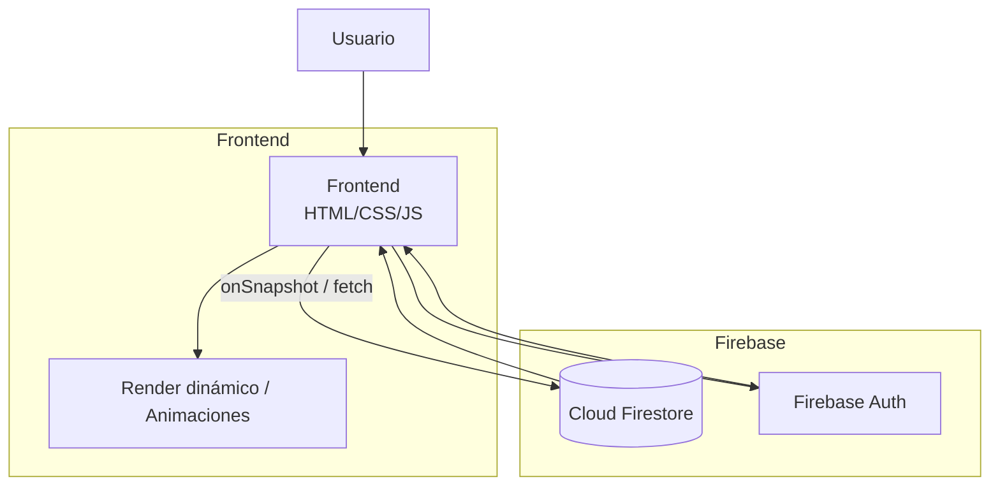
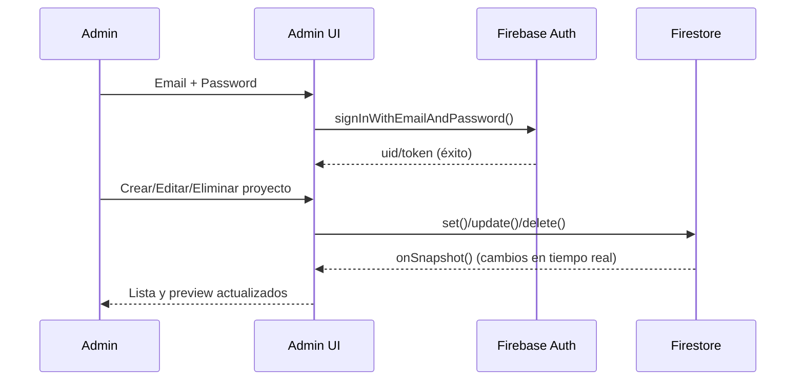
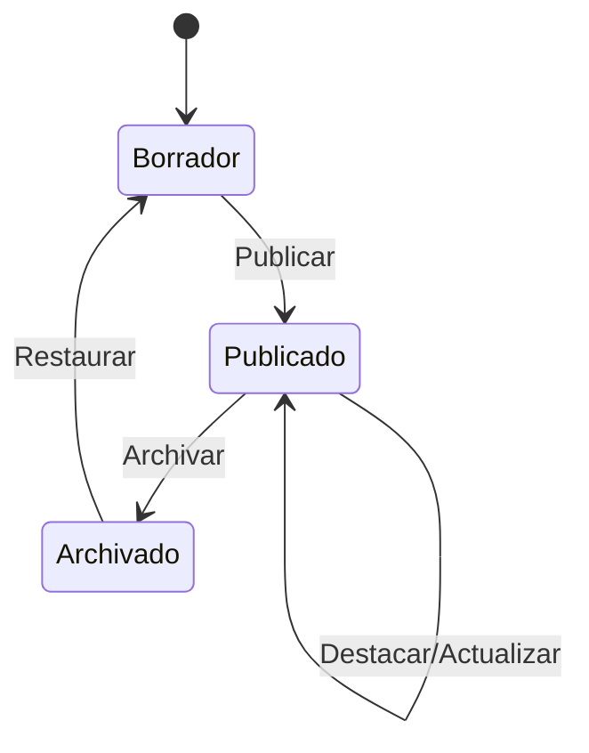
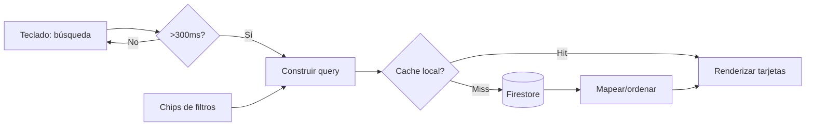
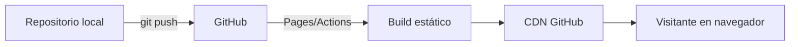

# 🚀 Portfolio Web Dinámico con Firebase

Un portfolio vivo y editable en tiempo real. Hecho con HTML, CSS, JavaScript y Firebase.


<div align="center">

[]((https://jhormancastella.github.io/Mis-webs/))

Explóralo y dime qué te parece.

</div>

---

## ✨ Qué incluye

### 🎯 Portfolio público
- Carga dinámica desde Firestore (sin recargar)
- Diseño responsive (desktop, tablet y móvil)
- Búsqueda en tiempo real + filtros por categoría
- Modo oscuro/claro con persistencia
- Animaciones suaves y estructura SEO friendly

### 🔐 Panel de administración
- Login con Firebase Authentication (Email/Password)
- CRUD completo con onSnapshot (actualización inmediata)
- Interfaz con validación visual y confirmaciones de seguridad
- Rutas protegidas para admins

---

## 🛠️ Tecnologías
- Frontend: HTML5, CSS3 (Grid/Flexbox), JavaScript ES6+
- BaaS: Firebase Auth, Cloud Firestore
- Hosting: GitHub Pages
- Performance: assets optimizados y carga rápida

---

## 👀 Vistas (más llamativas)

### 🖥️ Desktop (Portfolio con detalles y badges)
```text
┌──────────────────────────────────────────────────────────────────────────┐
│ ⛳ MI PORTFOLIO                                         ☀️/🌙  GitHub  📩 │
├──────────────────────────────────────────────────────────────────────────┤
│ 🔎 Buscar proyectos...      🏷️ Filtros: [Todas 12] [Herramientas 6]      │
│                                                [Mapas 3] [Entretenimiento 3] │
├──────────────────────────────────────────────────────────────────────────┤
│ ┌─────────────────────────┐  ┌─────────────────────────┐  ┌─────────────────────────┐
│ │ 🖼️  [Imagen]            │  │ 🖼️  [Imagen]            │  │ 🖼️  [Imagen]            │
│ │ 🎖️ Destacado           │  │                         │  │                         │
│ │ Título: Calculadora Pro │  │ Título: Mapa Interactivo│  │ Título: Juego Retro JS  │
│ │ Tags: #JS #UI #Tools    │  │ Tags: #Maps #Geo        │  │ Tags: #Canvas #Arcade   │
│ │ ─────────────────────── │  │ ─────────────────────── │  │ ─────────────────────── │
│ │ ▶️ Demo   ⎇ Repo  ⭐ 210 │  │ ▶️ Demo   ⎇ Repo  ⭐ 89  │  │ ▶️ Demo   ⎇ Repo  ⭐ 150 │
│ └─────────────────────────┘  └─────────────────────────┘  └─────────────────────────┘
│ ┌─────────────────────────┐  ┌─────────────────────────┐  ┌─────────────────────────┐
│ │ 🖼️  [Imagen]            │  │ 🖼️  [Imagen]            │  │ 🖼️  [Imagen]            │
│ │ Nuevo 🆕                │  │                         │  │                         │
│ │ Título: Dashboard Tasks │  │ Título: Weather App     │  │ Título: Quiz Master     │
│ │ Tags: #Charts #API      │  │ Tags: #API #UI          │  │ Tags: #Trivia #SPA      │
│ │ ─────────────────────── │  │ ─────────────────────── │  │ ─────────────────────── │
│ │ ▶️ Demo   ⎇ Repo  ⭐ 34  │  │ ▶️ Demo   ⎇ Repo  ⭐ 57  │  │ ▶️ Demo   ⎇ Repo  ⭐ 72  │
│ └─────────────────────────┘  └─────────────────────────┘  └─────────────────────────┘
├──────────────────────────────────────────────────────────────────────────┤
│ ⏳ Cargando más...  (infinite scroll / paginación)                        │
└──────────────────────────────────────────────────────────────────────────┘
```

### 📱 Móvil (toques “app-like” con barra inferior)
```text
┌─────────────────────────────────┐
│ ☰  Mi Portfolio                          🌙            │
├─────────────────────────────────┤
│ 🔎 Buscar...                                 ⏺ Filtros │
│ 🏷️ [Todas] [Herram.] [Mapas] [Entrete.]  → (scroll)   │
├─────────────────────────────────┤
│ ┌─────────────────────────────┐
│ │ 🖼️  [Imagen grande]         │
│ │ 🎖️ Destacado   🆕           │
│ │ Calculadora Pro             │
│ │ #JS #UI #Tools              │
│ │ ─────────────────────────   │
│ │ ▶️ Demo      ⎇ Repo    ⭐210 │
│ └─────────────────────────────┘
│ ┌─────────────────────────────┐
│ │ 🖼️  [Imagen grande]         │
│ │ Mapa Interactivo            │
│ │ #Maps #Geo                  │
│ │ ─────────────────────────   │
│ │ ▶️ Demo      ⎇ Repo     ⭐89 │
│ └─────────────────────────────┘
├─────────────────────────────────┤
│ ⌂ Inicio   🔍 Buscar   ⭐ Favoritos   👤 Perfil          │
└─────────────────────────────────┘
```

### ⚙️ Panel Admin (dashboard más visual y completo)
```text
┌──────────────────────────────────────────────────────────────────────────┐
│ 🔐 Admin Dashboard                               🔔 Notificaciones  👤  │
├──────────────────────────────────────────────────────────────────────────┤
│ 📊 Resumen:  Proyectos: 12   Publicados: 9   Borradores: 2   Visitas: 4.3K │
├───────────────┬───────────────────────────────────────────────────────────┤
│ 📚 Menú       │ 🎛️ Herramientas                                           │
│ - Dashboard   │ [+ Nuevo]  [⬇ Importar CSV] [⬆ Exportar] [⚙️ Filtros]      │
│ - Proyectos ▸ │ Ordenar: Fecha ▼   Estado: Todos ▼   🔎 Buscar...          │
│ - Categorías  ├───────────────────────────────────────────────────────────┤
│ - Usuarios    │ 🗂️ Proyectos                                              │
│ - Ajustes     │ ┌───────────────────────────────────────────────────────┐ │
│               │ │ ▣ | Título           | Estado  | Cat.   | Actualizado │ │
│               │ │───┼──────────────────┼─────────┼───────┼──────────── │ │
│               │ │ ▣ | Calculadora Pro  | ● Public| Herram | 2025-01-10 │ │
│               │ │    Acciones: ✏️ Edit  👁️ Preview  ⤴️ Publicar  🗑️      │ │
│               │ │ ▣ | Mapa Interactivo | ○ Borrad| Mapas  | 2025-01-08 │ │
│               │ │    Acciones: ✏️ Edit  👁️ Preview  ⤴️ Publicar  🗑️      │ │
│               │ │ ▣ | Juego Retro JS   | ● Public| Entrete| 2025-01-02 │ │
│               │ │    Acciones: ✏️ Edit  👁️ Preview  ⤴️ Destacar 🗑️      │ │
│               │ └───────────────────────────────────────────────────────┘ │
│               │ ◀ 1  2  3  ... 15 ▶                                     │
├───────────────┼───────────────────────────────────────────────────────────┤
│ 🧪 Inspector   │ 📝 Editor rápido (side panel)                            │
│ - General     │ [Título.................] [Slug auto]                     │
│ - Links       │ [URL web..] [URL GitHub..]                                │
│ - Media       │ [Logo URL..] [Cargar imagen ⬆]                            │
│ - SEO         │ [Descripción 160] [Keywords]                              │
│               │ ─────────────── Preview ───────────────                   │
│               │ ┌───────────────────────────────────────────────────────┐ │
│               │ │ 🖼️  [Imagen]   Título: Calculadora Pro  ⭐ 210         │ │
│               │ │ Tags: #JS #UI #Tools                                   │ │
│               │ │ ▶️ Demo  ⎇ Repo                                        │ │
│               │ └───────────────────────────────────────────────────────┘ │
│               │ [💾 Guardar]  [Cancelar]  ✅ Cambios guardados (toast)     │
└───────────────┴───────────────────────────────────────────────────────────┘
```

---

## 🧭 Diagramas en Mermaid

### Arquitectura general


### Flujo de administración (login y edición)


### Estados de un proyecto


### Pipeline de búsqueda y filtros


### Despliegue (GitHub Pages)


---

## 📁 Estructura de archivos
```bash
Mis-webs/
├── index.html                 # Portfolio público
├── admin.html                 # Panel de administración
├── styles.css                 # Estilos (ambas páginas)
├── main.js                    # Lógica del portfolio
├── admin.js                   # Lógica del panel admin
├── firebase-config.js         # Config e inicialización de Firebase
├── manifest.json              # Configuración PWA (opcional)
└── icons/
    ├── icon-192x192.png
    └── icon-512x512.png
```

---

## ⚡ Arranque rápido (5 minutos)

1) Clona el proyecto
```bash
git clone https://github.com/tu-usuario/Mis-webs.git
cd Mis-webs
```

2) Crea tu proyecto en Firebase
- Crea proyecto (Analytics opcional)
- Habilita Authentication → Email/Password
- Crea Firestore Database (modo Producción)

3) Pega tu configuración en firebase-config.js
```js
// firebase-config.js — REEMPLAZA CON TUS DATOS
const firebaseConfig = {
  apiKey: "tu-api-key",
  authDomain: "tu-proyecto.firebaseapp.com",
  projectId: "tu-proyecto-id",
  storageBucket: "tu-proyecto.appspot.com",
  messagingSenderId: "123456789",
  appId: "tu-app-id"
};
```

4) Reglas de Firestore
```js
rules_version = '2';
service cloud.firestore {
  match /databases/{database}/documents {
    match /projects/{document} {
      allow read: if true;                   // Público puede leer
      allow write: if request.auth != null;  // Solo usuarios autenticados
    }
  }
}
```

5) Crea tu usuario admin (Authentication → Users)

6) Sube a GitHub Pages
- Subir repo → Settings → Pages (main/root o Actions)
- URL: https://tu-usuario.github.io/Mis-webs/
- Tip: Live Server en VS Code para pruebas locales

---

## 💻 Uso

- Visitantes: exploran proyectos, usan búsqueda/filtros y cambian el tema (☀️/🌙)
- Administradores: acceden a /admin.html, inician sesión y gestionan proyectos (CRUD)

---

## 🎨 Personaliza a tu estilo

### Paleta y tema (styles.css)
```css
:root {
  --primary-color: #3b82f6;
  --secondary-color: #6366f1;
  --accent-color: #f59e0b;

  --bg-light: #ffffff;
  --text-light: #1f2937;

  --bg-dark: #0f172a;
  --text-dark: #f8fafc;

  --border-radius: 12px;
  --shadow: 0 10px 25px rgba(0,0,0,0.1);
}

/* Ejemplo rápido: paleta morada */
:root {
  --primary-color: #8b5cf6;
  --secondary-color: #a855f7;
  --accent-color: #d946ef;
}
```

### Nuevas categorías
- index.html (filtros):
```html
<button class="filter-btn" data-filter="Educacion">🎓 Educación</button>
<button class="filter-btn" data-filter="Negocios">💼 Negocios</button>
```
- admin.html (select):
```html
<option value="Educacion">🎓 Educación</option>
<option value="Negocios">💼 Negocios</option>
```

### Modelo de datos (Firestore)
```js
{
  title: "Nombre del Proyecto",
  logoUrl: "https://...",
  webUrl: "https://...",
  githubUrl: "https://...",
  description: "Descripción...",
  category: "Herramientas",
  createdAt: "2024-01-15",   // ISO o Timestamp
  featured: false
}
```

---

## 🔒 Seguridad

Incluye:
- Reglas: solo escribe quien está autenticado
- Validación de formularios
- Inputs saneados (prevención XSS básico)

Recomendado:
- Contraseñas robustas + 2FA
- Firebase App Check
- Backups periódicos
- Revisión de logs en Firebase Console

---

## 🧩 Problemas comunes

- Proyectos no cargan
  1) Abre consola (F12)
  2) Verifica documentos en Firestore
  3) Revisa reglas (lectura pública)

- Error al iniciar sesión
  1) Habilita Email/Password
  2) Comprueba usuario en Authentication
  3) Restablece contraseña

- Imágenes no cargan
  1) URLs públicas y HTTPS
  2) Considera Firebase Storage

---

## 📈 Roadmap

En desarrollo:
- Comentarios por proyecto
- Métricas de visitas (Analytics)
- Modo offline (Service Worker)
- Subida de imágenes a Storage

Planeado:
- Blog integrado
- Tags por proyecto
- Búsqueda avanzada
- Modo presentación full-screen

---

## 🤝 Contribuciones

1) Fork  
2) Rama: `git checkout -b feature/tu-feature`  
3) Commit: `git commit -m "feat: tu cambio"`  
4) Push: `git push origin feature/tu-feature`  
5) Pull Request

¿Bug? Abre un issue con pasos para reproducir, capturas, navegador y SO.

---

## 🙌 Agradecimientos

- Firebase, por un backend simple y potente
- Comunidad de GitHub, por el hosting y herramientas
- MDN Web Docs y Stack Overflow, por la guía del día a día

---

Todos los derechos reservados a jhorman Jesús castellanos Morales.
