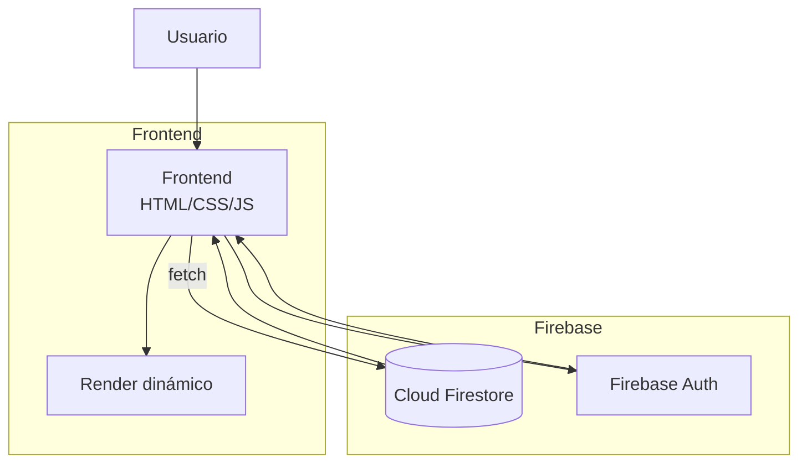
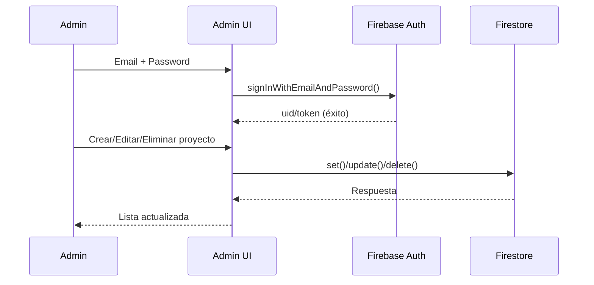
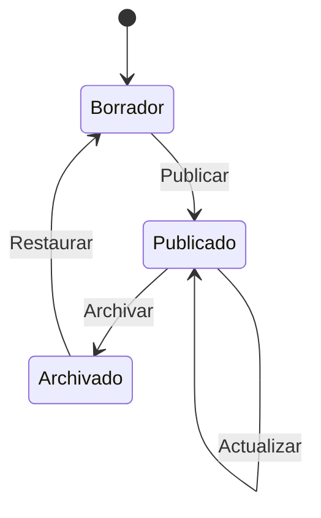
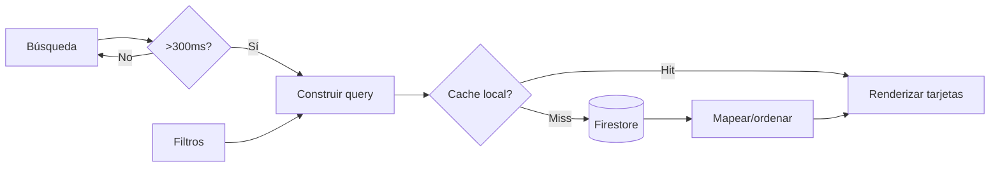

# 🚀 Portfolio Web Dinámico con Firebase

Un portfolio vivo y editable en tiempo real. Hecho con HTML, CSS, JavaScript y Firebase.


<div align="center">

[](https://jhormancastella.github.io/Mis-webs/)

</div>

---

## ✨ Qué incluye

- Carga dinámica de proyectos desde Firestore
- Diseño responsive (desktop, tablet y móvil)
- Búsqueda en tiempo real + filtros por categoría
- Modo oscuro/claro con persistencia
- Animaciones suaves y estructura SEO friendly
- Panel de administración con Firebase Authentication

---

## 🛠️ Tecnologías

- Frontend: HTML5, CSS3 (Grid/Flexbox), JavaScript ES6+
- BaaS: Firebase Auth, Cloud Firestore
- Hosting: GitHub Pages + GitLab

---

## 🧭 Diagramas

### Arquitectura general

```mermaid
graph TD
  U[Usuario] --> FE[Frontend<br/>HTML/CSS/JS]
  FE -->|fetch| FS[(Cloud Firestore)]
  FE --> AU[Firebase Auth]
  AU --> FE
  FS --> FE
  FE --> UI[Render dinámico]
  subgraph Frontend
    FE
    UI
  end
  subgraph Firebase
    AU
    FS
  end
```

### Flujo de administración

```mermaid
sequenceDiagram
  participant A as Admin
  participant UI as Admin UI
  participant Auth as Firebase Auth
  participant DB as Firestore

  A->>UI: Email + Password
  UI->>Auth: signInWithEmailAndPassword()
  Auth-->>UI: uid/token (éxito)
  A->>UI: Crear/Editar/Eliminar proyecto
  UI->>DB: set()/update()/delete()
  DB-->>UI: Respuesta
  UI-->>A: Lista actualizada
```

### Estados de un proyecto

```mermaid
stateDiagram-v2
  [*] --> Borrador
  Borrador --> Publicado: Publicar
  Publicado --> Archivado: Archivar
  Archivado --> Borrador: Restaurar
  Publicado --> Publicado: Actualizar
```

### Pipeline de búsqueda y filtros

```mermaid
flowchart LR
  Input[Búsqueda] --> Debounce{>300ms?}
  Debounce -- No --> Input
  Debounce -- Sí --> Query[Construir query]
  Filters[Filtros] --> Query
  Query --> Cache{Cache local?}
  Cache -- Hit --> Render[Renderizar tarjetas]
  Cache -- Miss --> Firestore[(Firestore)]
  Firestore --> Normalizar[Mapear/ordenar]
  Normalizar --> Render
```

---

## 🔒 Seguridad

- Reglas de Firestore: solo escribe quien está autenticado
- Validación de formularios y sanitización de inputs

### Reglas de Firestore
```js
rules_version = '2';
service cloud.firestore {
  match /databases/{database}/documents {
    match /projects/{document} {
      allow read: if true;
      allow write: if request.auth != null;
    }
  }
}
```

---

## 📁 Estructura

```bash
Mis-webs/
├── index.html       # Portfolio público
├── main.js          # Lógica del portfolio
├── style.css        # Estilos
├── robots.txt
└── sitemap.xml
```

---

Todos los derechos reservados a Jhorman Jesús Castellanos Morales.
